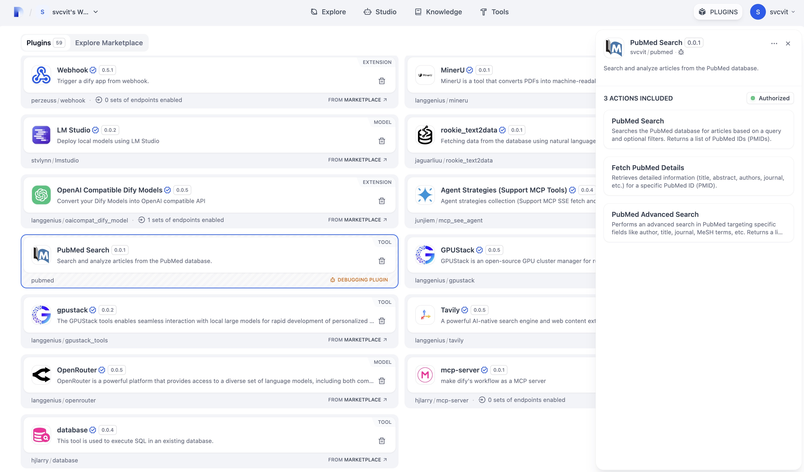
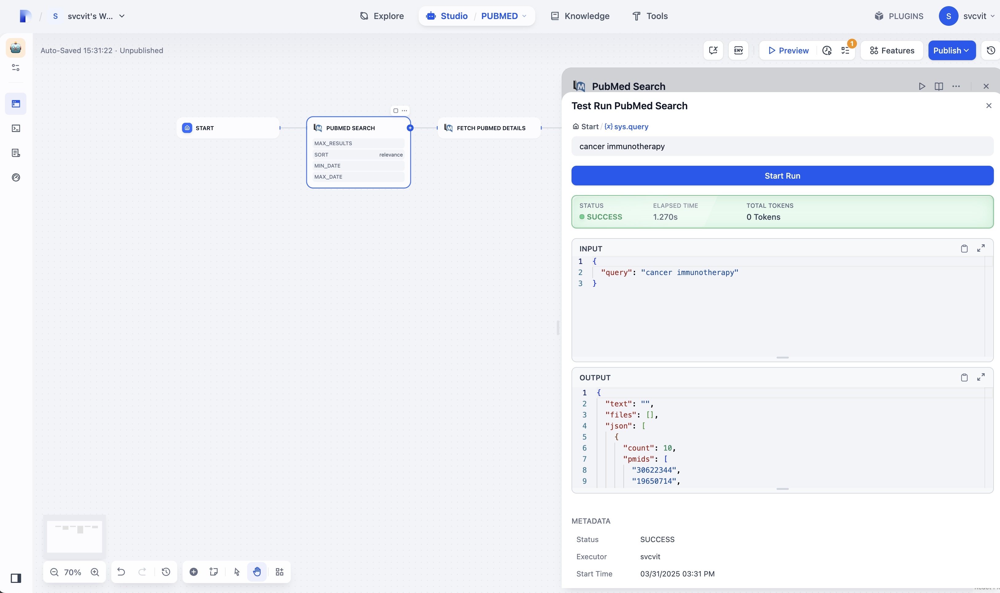
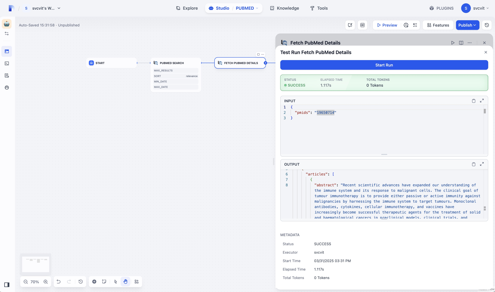
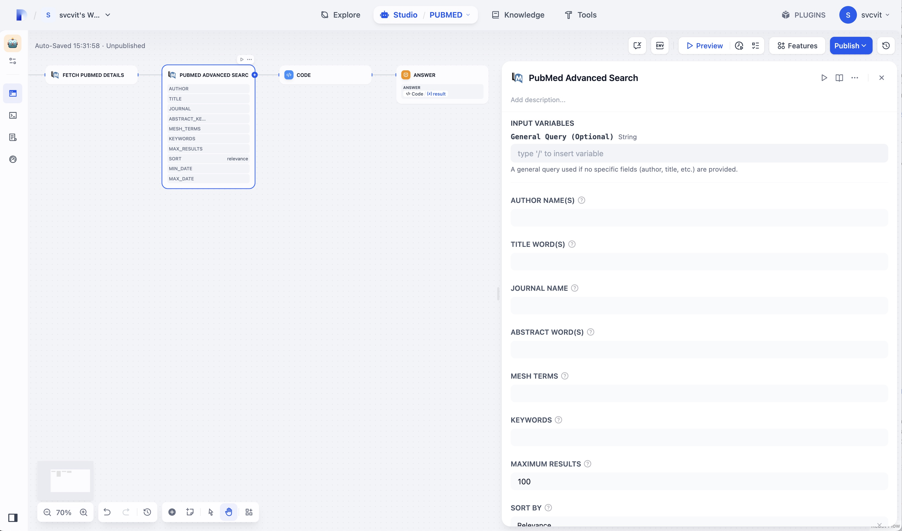

# Dify PubMed Plugin

**Author:** svcvit
**Version:** 0.0.1
**Type:** plugin

## Description

This Dify plugin provides tools to interact with the National Library of Medicine's PubMed database, allowing users to search for biomedical literature and analyze the results directly within Dify workflows.

## Features

*   **PubMed Search:** Search articles using keywords, filters (date range), and sorting options. Returns a list of PubMed IDs (PMIDs).
*   **PubMed Details:** Retrieve detailed information for a specific PubMed article, including title, abstract, authors, journal, and more.
*   **Advanced Search:** Perform targeted searches using specific fields like author, title, journal, MeSH terms, and more.

## Setup and Authorization

1.  Add this plugin to your Dify application.
2.  Authorize the plugin by providing:
    *   **Email Address:** Your valid email address. This is **required** by NCBI for API access identification.
    *   **NCBI API Key:** Required for PubMed API access.
        
        Steps to get an API Key:
        1. Create an NCBI account (if you don't have one): https://www.ncbi.nlm.nih.gov/account/
        2. Generate an API key:
           - Go to https://www.ncbi.nlm.nih.gov/account/settings/
           - Scroll down to the API Key section
           - Click to create an API Key
           - Copy the generated key

## Usage

### Tool: PubMed Search (`search`)
Allows you to search the PubMed database using keywords and various filters. You can specify the maximum number of results, sort order (by relevance or publication date), and filter by publication date range.

### Tool: PubMed Details (`fetch_details`)
Retrieves comprehensive information about a specific article using its PubMed ID (PMID). This includes the article's title, abstract, authors, publication date, journal information, keywords, and MeSH terms.

### Tool: Advanced Search (`advanced_search`)
Provides more precise control over your PubMed searches by allowing you to target specific fields:
- Author names
- Article titles
- Journal names
- Abstract keywords
- MeSH terms
- General keywords
Plus the same filtering options as the basic search (date range, sorting, etc.)

## Contact

For support and feedback, please create an issue in the repository.